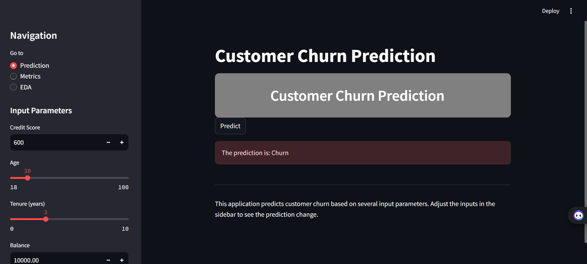
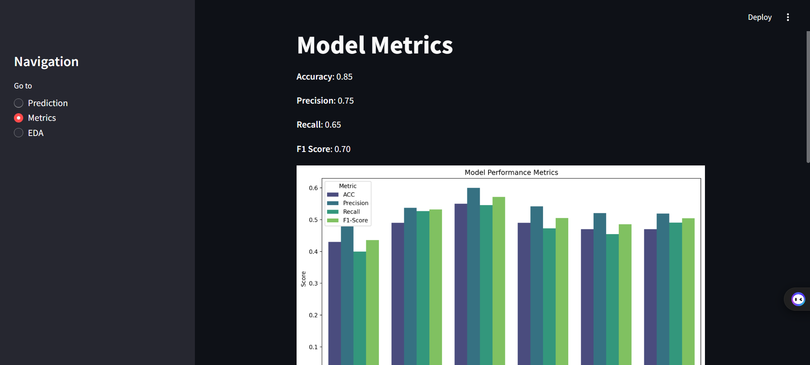
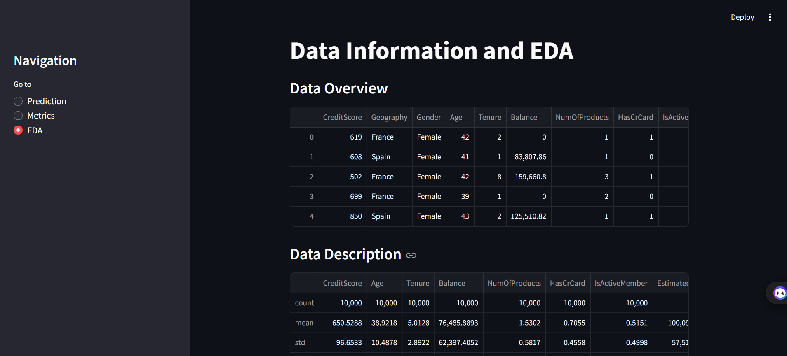

# Customer Churn Prediction App

This is a Streamlit web application for predicting customer churn based on various input parameters. It includes features for predicting customer behavior and visualizing model performance metrics.

The application consists of three main pages:

1. **Prediction**: Allows users to input customer details such as credit score, age, tenure, balance, etc., to predict whether a customer will churn or not using a pre-trained machine learning model.

   

2. **Metrics**: Displays model performance metrics such as accuracy, precision, recall, and F1-score for multiple models. It includes visualizations of these metrics using bar plots, confusion matrices.

   

3. **EDA (Exploratory Data Analysis)**: Provides insights into the dataset used for training the model. It includes univariate and bivariate analysis plots such as histograms, count plots, scatter plots, and correlation heatmaps to explore relationships between variables.

   

## Overview

The application consists of three main pages:

1. **Prediction**: Allows users to input customer details such as credit score, age, tenure, balance, etc., to predict whether a customer will churn or not using a pre-trained machine learning model.

2. **Metrics**: Displays model performance metrics such as accuracy, precision, recall, and F1-score for multiple models. It includes visualizations of these metrics using bar plots, confusion matrices, and ROC curves.

3. **EDA (Exploratory Data Analysis)**: Provides insights into the dataset used for training the model. It includes univariate and bivariate analysis plots such as histograms, count plots, scatter plots, and correlation heatmaps to explore relationships between variables.

## Features

- **Prediction Page**:
  - Interactive sidebar for inputting customer data.
  - Real-time prediction of customer churn.
  
- **Metrics Page**:
  - Comparison of model performance metrics (accuracy, precision, recall, F1-score) across multiple models.
  - Visualizations of metrics using bar plots, confusion matrices, and ROC curves.

- **EDA Page**:
  - Overview of the dataset with basic statistics and data head.
  - Univariate analysis with histograms and count plots.
  - Bivariate analysis with scatter plots and bar plots.
  - Multivariate analysis with a correlation heatmap.

## Setup Instructions

1. Clone the repository:

2. Install the required Python packages:

3. Run the Streamlit application:

4. Open the application in your browser:

## Data Sources

- The application uses the `Churn_Modelling.csv` dataset located in the `dataset` directory. This dataset includes customer information and churn status.

## Model Training

- The predictive models used in the application are trained using machine learning techniques. Model training details are included in the `model_training.ipynb` notebook.

## Libraries Used

- Python: Pandas, NumPy, Matplotlib, Seaborn, Scikit-learn
- Streamlit: For building and deploying the web application

## Author

- Sumit Kudale

## License

This project is licensed under the MIT License - see the LICENSE file for details.

